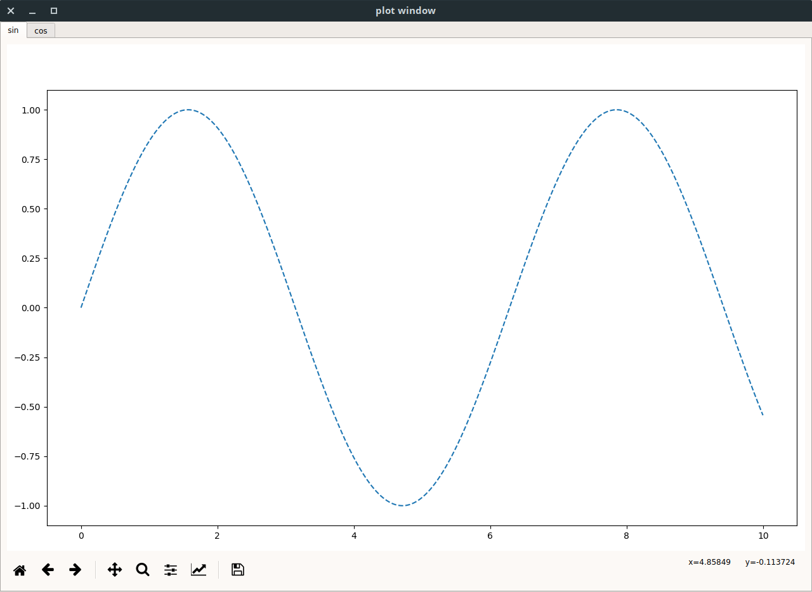

# Matplotlib Tabbed Plots

This is a simple wrapper for matplotlib that puts all the plots into a neatly organized tabbed layout.

A simple example of how to use this is in the main function at the bottom of `plotWindow.py`.  Pretty much, all you do is create a `plotWindow` object, and pass the figure handles to plots through the `addPlot` method along with the titles of the tabs.  When you are done creating plots, call the `show` method.

``` python

from plotWindow.plotWindow import plotWindow
import matplotlib.pyplot as plt
import numpy as np

pw = plotWindow()

x = np.arange(0, 10, 0.001)

f = plt.figure()
ysin = np.sin(x)
plt.plot(x, ysin, '--')
pw.addPlot("sin", f)

f = plt.figure()
ycos = np.cos(x)
plt.plot(x, ycos, '--')
pw.addPlot("cos", f)

pw.show()
```

This code will result in the following GUI


